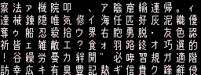

# FEDS_Font_Tool

The Fire Emblem DS Font Tool

## What does FEDS_Font_Tool Do

Currently, de/reciphering 4bpp fonts and 2bpp (``sys_wars`` and ``system``) are implemented. The deciphered output can be opened with [Crystal Tiles 2](https://www.romhacking.net/utilities/818/).

For 4bpp fonts, the tile form is 4bpp GBA, 4-byte skipped, 16×16. Use ``4bpp.pal`` as a predefined palette to see the glyphs clearly. In the skipped 4-bytes, the following are written: low byte, high byte, width and null.

For aforementioned 2bpp fonts, the tile form is 2bpp VB, 4-byte skipped, 8×16. In the skipped 4-bytes, the following are written: high byte, width, low byte and null.

For convenience, when deciphering, a list (tab-separated) of characters in the source font is created.

## File Specs

### Talk
The Fire Emblem DS font files, ``fonts/talk`` used for dialogs are weird. ``fonts/alpha`` is written in the same way, but there is likely no need to edit ``alpha``. Not related to font files, but some class demo images in ``intro/L*`` and ``intro/S*`` archives, prefixed ``0x50``, use the same format. Though the data is quite complicated to understand, there was not a documentation for that, so I had to decipher for a few days and write a documentation for them.

#### Parts
The first thirty-two bytes are the header for the file as usual, containing total size of the file (4 bytes), location of the pointer list (4 bytes), and the number of pointers (4 bytes). Because of this header, the value of every pointer is the relative address after the header (i.e. from 0x20), including the aforementioned pointer list location on the header. For example, if the physical location of the pointer list is ``0x8020``, it should be written as ``0x8000`` i.e. ``00 80 00 00``.

After the header, the data is separated by four parts. The first part contains the addresses of glyph data lists by low bytes (0x40..0xFF). The second part contains such lists, where those are separated by 32-bit zeros. Each glyph data in a list consists of eight bytes and contains full character code (2 bytes), width (2 bytes) and the location of glyph data (4 bytes). The third part is the glyph data (where the boundary of each glyph may not visible), and the fourth part is the pointer list containing the location of every pointers.

#### Glyph
In short, each glyph is compressed (or, I would say, ciphered) using some sort of [Run-length encoding](https://en.wikipedia.org/wiki/Run-length_encoding). The deciphered glyph is of 4bpp format.

The binary data for a glyph is separated into blocks of five bytes.

The first byte indicates if the pixel to be written is transparent or not. A bit ``1`` is for transparent, and ``0`` for coloured.

The following four bytes indicate the amount of transparent pixels or the colour of a pixel. For example, a half-byte ``0xF`` means sixteen (i.e. 0xF + 1) transparent pixels or a pixel coloured F (white), depending on a particular bit of the first byte.

Note that the bits from the first byte should be read from the least-significant bit(bit 0), while the half-bytes should be with human-reading order: Let's see the next example.

* Example Raw data: ``55 0C 5D AE FF``
* The first byte in binary is ``01010101``.
0. Bit 0 is 1, and half-byte 0 is 0. Thus, the first one pixel is transparent.
1. Bit 1 is 0, and half-byte 1 is C. Thus, the following is a pixel with a colour C.
2. Bit 2 is 1, and half-byte 2 is 5. Thus, the following are transparent, and the number of them is 6 ( = 0x5 + 1).
3. Bit 3 is 0, and half-byte 3 is D. Thus, the following is a pixel with a colour D.
4. Bit 4 is 1, and half-byte 4 is A. Thus, the following are transparent, and the number of them is 11 ( = 0xA + 1).
5. Bit 5 is 0, and half-byte 5 is E. Thus, the following is a pixel with a colour E.
6. Bit 6 is 1, and half-byte 6 is F. Thus, the following are transparent, and the number of them is 16 ( = 0xF + 1).
7. Bit 7 is 0, and half-byte 7 is F. Thus, the following is a pixel with a colour F.

When the binary is deciphered, the pixel is drawn by following order on 16-by-16 cells:
* Pixels are drawn from the top row.
* For each row, they are drawn in order of: ``7 6 5 4 3 2 1 0 F E D C B A 9 8``. In other words, split by half, left first; for each part, right first.

The binary is read until 256 pixels are filled, so the size of each glyph may not be divisible by five bytes. For example, ``01 F0`` as the last block of the glyph data is valid, if, say, the first pixel coloured F is the last of 256 pixels.

##### Colour
The below table is an example of colour for each half-byte, if the background is dark. Attached ``4bpp.pal`` is a palette implementing it.
Half-byte | Colour
----------|-------
0x0 | (Transparent)
0x1 | #480808
0x2 | #501818
0x3 | #602828
0x4 | #683838
0x5 | #784848
0x6 | #805858
0x7 | #906868
0x8 | #987878
0x9 | #A08888
0xA | #B09898
0xB | #B8A8A8
0xC | #C8B8B8
0xD | #D0C8C8
0xE | #E0D8D8
0xF | #E8E8E8

# Credits
* DSDecmp - https://github.com/einstein95/dsdecmp